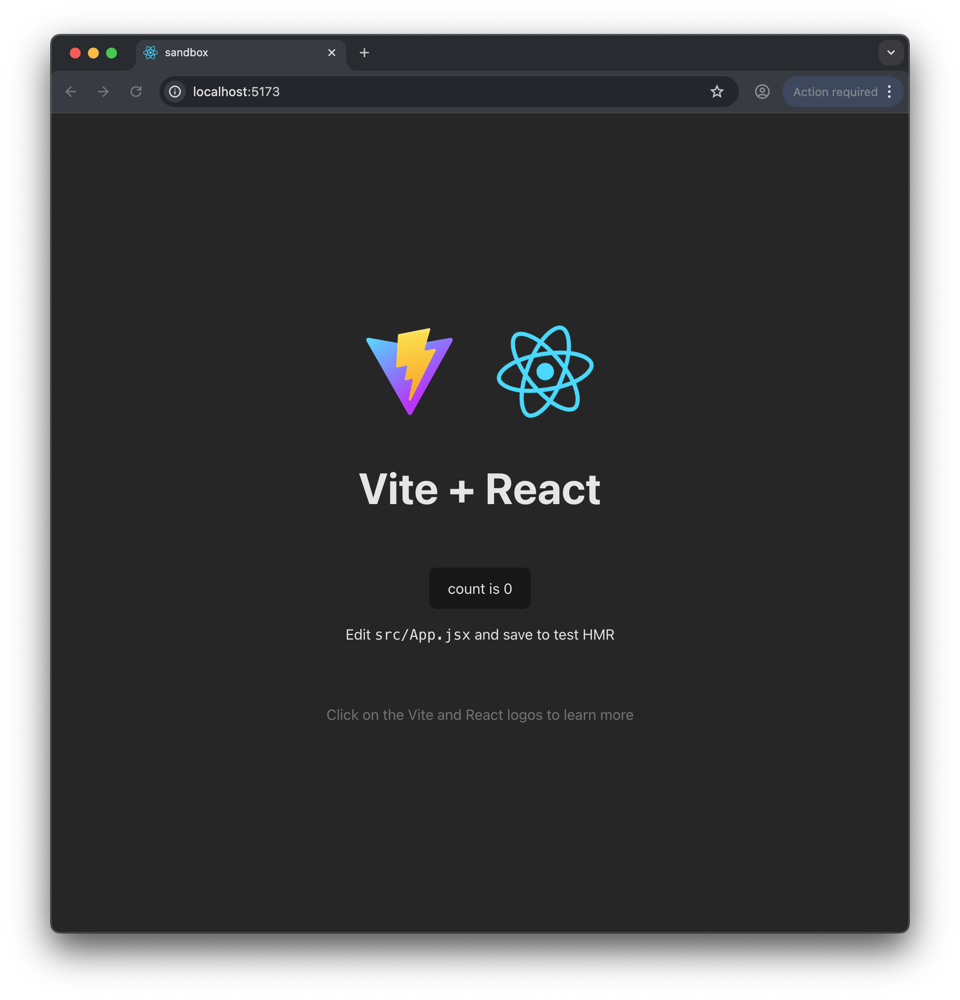

# Vite Tailwind React Starter

Template for new projects for React with Tailwind and Vite.

> This version of template for Tailwind V3. For version v4 of tailwind check out https://github.com/RafalSkolasinski/vite-react-tailwind-template.

## Motivation

Vite can create a great looking starting project for React.
I just wanted to see how it would look when using Tailwind.

If someone know how to improve it or have comments, you know where the issue tracker is :-).

## How to use

1. Clone the repo.
2. Install deps with `pnpm install`
3. Run server with `pnpm run dev`

Enjoy!

